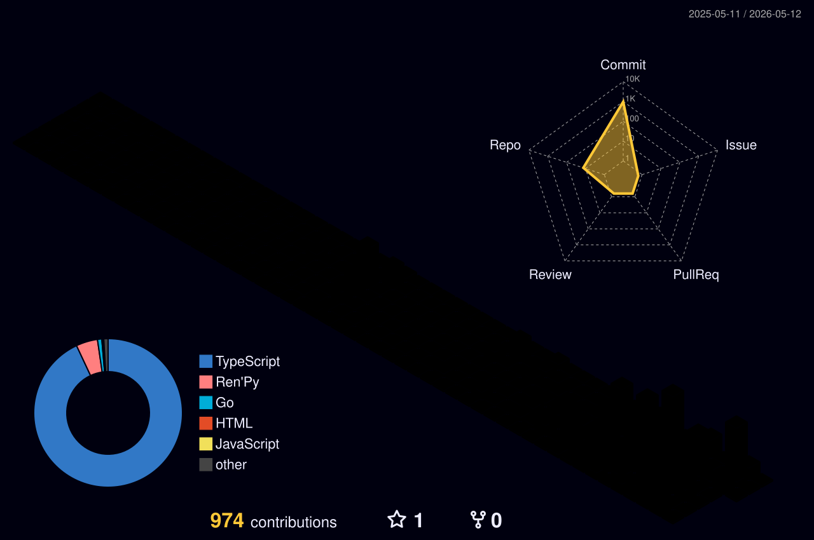

<div align="center">
  <a href="https://readme-typing-svg.demolab.com">
    
  </a>
</div>

<br/>

<div align="center">
  <a href="https://linkedin.com/in/raffaelramalhorosa">
    
  </a>
  &nbsp;
  <a href="https://nexosgg.com/rafael_ramalhorosa">
    
  </a>
  &nbsp;
  <a href="mailto:raffael.ramalho.rosa@gmail.com">
    
  </a>
  &nbsp;
  
</div>

---

## &nbsp;About me

```typescript
const rafael = {
  role:       "Full Stack Developer",
  location:   "Lagoa Santa, MG — Brazil 🇧🇷",
  languages:  ["Portuguese (native)", "English (fluent)"],
  education:  "Computer Science @ Centro Universitário Una (2027)",
  currentJob: "R3D3 Desenvolvimentos — Jan/2026 → present",
  building:   "NexosGG — link-in-bio platform for gamers",
  interests:  ["web apps", "real-time systems", "clean architecture"],
};
```

---

## &nbsp;Tech Stack

<div align="center">

**Frontend**


**Backend & Database**


**Tools**


</div>

<br/>

<div align="center">
  
  
  
  
  
  
</div>

---

## &nbsp;Featured Project

<a href="https://github.com/raffaelramalhorosa/nexosgg.com">
  
</a>

<br clear="left"/>

> **NexosGG** — Link-in-bio platform for streamers and gamers.
> React 19 · TypeScript · Go · Supabase · Stripe · Cloudflare Workers · Real-time Discord presence

---

## &nbsp;Activity


---

## &nbsp;3D Contribution Calendar

<picture>
  <source media="(prefers-color-scheme: dark)" srcset="profile-3d-contrib/profile-night-rainbow.svg" />
  <source media="(prefers-color-scheme: light)" srcset="profile-3d-contrib/profile-south-season-animate.svg" />
  
</picture>

---

## &nbsp;Contribution Snake

<picture>
  <source media="(prefers-color-scheme: dark)" srcset="https://raw.githubusercontent.com/raffaelramalhorosa/raffaelramalhorosa/output/github-contribution-grid-snake-dark.svg" />
  <source media="(prefers-color-scheme: light)" srcset="https://raw.githubusercontent.com/raffaelramalhorosa/raffaelramalhorosa/output/github-contribution-grid-snake.svg" />
  
</picture>

---


